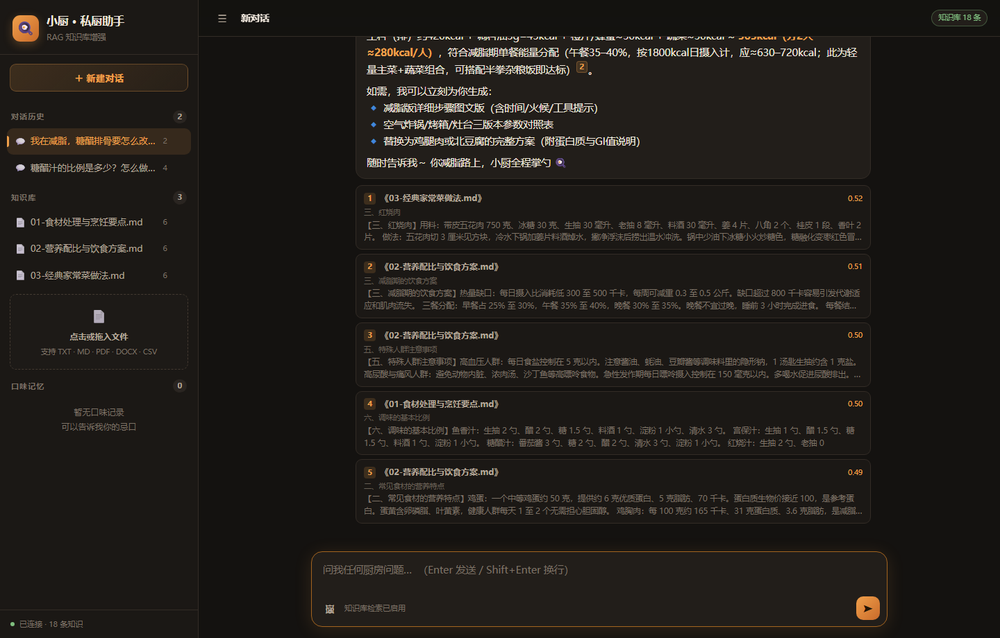

# 私厨 AI 助手 · RAG + Agent + 复杂度路由

一个**真正带检索增强生成（RAG）**的厨房饮食助手：上传自己的菜谱 / 营养资料，
提问时会先从知识库检索相关片段，再让大模型基于这些片段作答，并标注引用来源。

在此基础上加了两层：**Agent 工具循环**（模型自己决定查不查、查几次、查什么），
以及**按问题复杂度自动分派**（闲聊直接答、单跳走 RAG、复杂走 Agent）。

技术栈：FastAPI + Chroma + 通义千问（deepseek-v4.1-flash / text-embedding-v4）+ 原生 HTML/JS 前端。



<table>
<tr>
<td width="50%"></td>
<td width="50%"></td>
</tr>
</table>

**它和普通 ChatGPT 套壳的区别：**

| | 普通套壳 | 本项目 |
|---|---|---|
| 知识来源 | 模型自己记得的 | 你上传的文档 |
| 能否溯源 | 不能 | 每句话标注来自哪份文件第几节 |
| 知识过期 | 只能等模型升级 | 传新文档立刻生效 |
| 不知道时 | 一本正经编 | 明确说「知识库里没有」，通用建议另行标注 |
| 查不查资料 | 不会查 | 模型自己决定，按需查多次 |
| 复杂问题 | 一次性猜 | 先查用量、再查营养、再算，分步完成 |
| 简单问题 | 也走一遍重流程 | 自动走轻量路线，不做无用检索 |
| 多轮对话 | 可能忘记上下文 | 指代消解 + 长期口味记忆 |

---

## 一、怎么启动

```bat
:: Windows 直接双击 start_server.bat
:: 或者命令行：
venv\Scripts\python.exe run_app.py
```

启动后浏览器自动打开 <http://127.0.0.1:8001>。

首次在新机器上部署：

```bat
python -m venv venv
venv\Scripts\pip install -r requirements.txt
```

然后在 `.env` 里填好 Key（照 `.env.example` 抄一份改名即可）。

---

## 一·五、怎么换模型

模型分三块，**能力不同，不能随便互换**：

| 配置块 | 用途 | 能换成什么 |
|---|---|---|
| `CHAT_*` | 文本对话 | 千问 / DeepSeek / 任意 OpenAI 兼容服务 |
| `VISION_*` | 看食材照片 | 千问 `qwen-vl-*` / GPT-4o 等**有视觉能力**的 |
| `EMBEDDING_*` | 把文字变向量 | 千问 `text-embedding-v4` / OpenAI 等**有 embedding 接口**的 |

### 换对话模型

**方式一：通过千问（DashScope）调 DeepSeek** —— 只改模型名，一行搞定：

```ini
CHAT_MODEL=deepseek-v4.1-flash
```

**方式二：走 DeepSeek 官方 API** —— 三行都要填：

```ini
CHAT_API_KEY=sk-你的DeepSeekKey
CHAT_BASE_URL=https://api.deepseek.com
CHAT_MODEL=deepseek-chat
```

> ⚠️ **最容易踩的坑：两家平台模型命名不一样。**
>
> | 平台 | 模型名 |
> |---|---|
> | 千问 DashScope | `deepseek-v4.1-flash` / `deepseek-v4-pro` |
> | DeepSeek 官方 | `deepseek-chat` / `deepseek-reasoner` |
>
> 混着填会得到 `404 The model xxx does not exist`。代码里已经把这种错误翻译成人话了。

### 为什么视觉仍然用千问

`deepseek-v4.1-flash` **确实支持看图**，实测能准确读出截图里的文字。
但它是**推理模型**——回答前要先思考，而思考 token 也算钱。

同一张图、同一句提示词：

| 模型 | 耗时 | 思考 token | 正文 token | 稳定性 |
|---|---|---|---|---|
| `qwen3-vl-plus` | 5.7 s | 0 | 29 | 稳定 |
| `deepseek-v4.1-flash` | 9~15 s | **1378 ~ 5190** | 67 | 配额给小了正文就是空 |

思考长度每次都不一样（实测跳了 4 倍），所以用它做视觉得把
`VISION_MAX_TOKENS` 抬到 8000 才勉强稳。为了列一个食材清单花 5000 个 token，
不划算。**所以视觉默认 `qwen3-vl-plus`，对话随你选。**

### embedding 为什么不能换 DeepSeek

```bash
POST https://api.deepseek.com/embeddings    → 404
POST https://api.deepseek.com/v1/embeddings → 404
```

DeepSeek 官方文档的 12 个端点里没有任何向量接口。向量只能用千问。

代码里三块配置是彼此隔离的：`VISION_*` 不继承 `CHAT_*`，换对话模型不影响图片识别。
配错了 `/api/health` 的 `config_warnings` 会明确提示，前端顶栏亮红色角标。

---

## 二、它到底怎么工作的

```
用户提问
   │
   ├─ 1. 把问题（+ 上一轮提问）向量化  ──► text-embedding-v4，1024 维
   │
   ├─ 2. 在 Chroma 里做余弦相似度检索  ──► 取回 Top-K 片段，过滤低分
   │
   ├─ 3. 把片段拼成带编号的上下文      ──► [1] 《文件名》章节 · 相关度 0.76
   │
   ├─ 4. 系统提示词 + 长期偏好 + 上下文 + 历史 + 当前问题 ──► qwen-plus
   │
   └─ 5. 流式返回（SSE），同时解析正文里的 [1][2] 标注
          └─► 前端渲染成可折叠的来源卡片
```

### 关键设计取舍

| 问题 | 做法 | 为什么 |
|------|------|--------|
| 切分粒度 | 先按 Markdown 标题切"节"，节内超长再按句子切 | 一块只讲一件事，向量才准确；混着多个主题的块检索必然不准 |
| 章节前缀 | 每个片段的文本前面拼 `【章节标题】` | 让向量带上主题上下文，短片段也能被正确召回 |
| 相似度门槛 | 低于 0.38 的片段直接丢弃 | 实测低于这个值的都是"同文档不同主题"，塞进去只会干扰模型 |
| 检索失败怎么办 | 明确告知"知识库没有"，通用建议要标注来源性质 | 不允许模型拿常识硬编，这是幻觉的主要来源 |
| 多轮指代 | 短问句会拼接上一轮提问再检索 | 「那减脂版怎么调整？」单独拿去检索什么都搜不到 |
| 引用校验 | 正则提取 `[N]`，越界编号丢弃，未使用的置灰 | 模型可能编出不存在的编号，必须做边界校验 |

---

## 二·五、Agent 模式

上面的流程有个根本问题：**检索是代码决定的，不是模型决定的。**
代码固定检索一次、固定取 Top-5，然后祈祷这 5 条里刚好有答案。

实测暴露了三种它答不好的情况：

| 情况 | RAG 版表现 | 为什么 |
|------|-----------|--------|
| 多跳问题 | 只能答一半 | 「红烧肉多少热量」需要先取用量、再查营养、再算三件事，一次检索凑不齐 |
| 闲聊 | 白做一次检索 | 实测 `sources` 是 0 条 —— 没拉回无关片段，但向量化那次网络往返照样要付 |
| 需要算数 | 模型自己心算 | 大模型算乘法经常错，而且错得很自信 |
| 列举 | 会漏 | 「有哪几道菜」实测答 4 道，实际 6 道 —— 语义检索天生会漏 |

Agent 模式把「查不查、查几次、查什么」交给模型决定：

```
用户提问
   │
   ├─ 模型判断：这个问题需要什么信息？
   │
   ├─ 要查 → 调用工具（search_kb / get_dish / calc_nutrition / list_dishes）
   │           │
   │           └─ 工具结果塞回对话历史 → 回到第一步重新判断
   │
   └─ 不需要了 → 输出最终答案（流式）
```

核心就是一个循环，不到 20 行：

```python
for step in range(MAX_STEPS):
    resp = call_model(messages, tools=TOOLS)
    if not resp.tool_calls:
        return resp.content          # 模型说"不用查了"，输出答案
    for call in resp.tool_calls:
        result = execute(call.name, call.args)
        messages.append(tool_result(call.id, result))
```

### 四个工具

| 工具 | 干什么 | 什么时候用 |
|------|--------|-----------|
| `search_kb` | 语义检索知识库 | 问做法、配比、营养知识、保存方法 |
| `get_dish` | 按菜名精确取一道菜 | 问知识库里那 6 道菜（比语义检索准，不会召回无关片段） |
| `list_dishes` | 列出所有菜名 | 问「你会做什么」「有什么菜」 |
| `calc_nutrition` | 按食材和克数算热量/蛋白质/脂肪 | 任何要给出具体数字的问题 |

### 三个必须知道的坑

**1. 工具描述就是模型的唯一判断依据。**
模型看不到函数体，它只看 `description` 里那几行字。描述写得含糊，它就会该调不调、或者乱调。
所以每个描述都按「是什么 / 有什么内容 / 什么时候用」三段写。

**2. 流式返回的 tool_calls 是碎片，必须按 `index` 分组拼。**
模型可能一次并行发多个调用。把所有碎片直接拼起来会得到
`search_kbsearch_kb` 和 `{...}{...}`，`json.loads` 直接报 `Extra data`。
规则是：**组内拼，组间不拼。**

**3. 必须有步数上限。**
模型有可能反复查同一个词、或者揪着一个报错的工具不放。
`AGENT_MAX_STEPS=6` 不是性能参数，是保险丝 —— 没有它，一个问题可能烧掉一整天额度。

### 实测对比：往返次数是结构，秒数是运气

先看**结构**（不随网络变化，永远成立）：

| 问题 | RAG 版 | Agent 版 | 稳定结论 |
|------|--------|----------|----------|
| 闲聊「你好呀」 | 向量化 1 次 + 模型 1 次 | **只有模型 1 次** | Agent 少一次往返 |
| 单跳「糖醋汁比例」 | 向量化 1 次 + 模型 1 次 | 向量化 1 次 + **模型 2 次** | RAG 少一次模型调用 |

再看**质量**（跟快慢无关）：

| 问题 | RAG 版 | Agent 版 |
|------|--------|----------|
| 多跳「红烧肉多少热量」 | 只能给 3800–4300 的估算 | **3130 千卡 / 一人份 783 千卡** |
| 「知识库里有哪几道菜」 | **答 4 道（错，实际 6 道）** | **答 6 道（对）** |
| 「糖醋排骨怎么做」 | 如实说没有 | 如实说没有 + 给出可套用的糖醋汁比例 |

最后才是**秒数**。下面这些是在网络健康时测的
（先跑 `probe_network.py` 确认：向量化中位 0.52s、极差 0.07s，模型中位 0.75s，然后才开测）：

| 题型 | 样本 | 中位 | 极差 |
|------|------|------|------|
| 闲聊 · RAG | 3.6 / 3.8 / 3.9 / 4.0 / 5.8 | 3.9s | 2.1s |
| 闲聊 · Agent | 1.6 / 1.6 / 1.7 / 1.7 / 1.8 | **1.7s** | **0.1s** |
| 单跳 · RAG | 3.0 / 3.9 / 6.1 | **3.9s** | 3.2s |
| 单跳 · Agent | 5.9 / 6.3 / 7.8 | 6.3s | 1.9s |

两个范围**不重叠**：闲聊 Agent 快 2.2 秒，单跳 RAG 快 2.4 秒。

⚠️ **但这张表只在网络健康时成立。** 同一个脚本在代理没关的时候跑，得到的是：

```
闲聊 RAG   4.0 / 5.3 / 5.3 / 7.3 / 35.4   中位 5.3s  极差 31.4s
闲聊 Agent 2.2 / 3.9 / 4.2 / 16.3 / 29.9  中位 4.2s  极差 27.7s
重叠区间 26.0s
```

秒数从「Agent 快 5 秒」到「Agent 慢 26 秒」都出现过。**所以结论要下在往返次数上，秒数只能当参考。**

**结论要诚实：Agent 不是全面更好。**

它明确赢在：闲聊少一次往返、多跳能给精确数字、列举不会漏。
它明确输在：**单跳题要多付一次模型调用**，因为「决定查什么」和「根据结果作答」被拆成了两次。

正是这个「输」引出了下一节的复杂度路由。

---

## 二·六、问题复杂度路由

既然 Agent 在单跳题上更慢、在复杂题上更对，那就**按问题难度分派**，别全局开一种。

三条路：

| 路线 | 干什么 | 网络往返 |
|------|--------|----------|
| `chat` | 不检索，直接答 | 模型 1 次 |
| `rag` | 固定检索一次再答 | 向量化 1 次 + 模型 1 次 |
| `agent` | 工具循环，按需检索 | 向量化 1 次 + 模型 N 次 |

判断全用规则，**不调模型** —— 用模型判断「这题难不难」本身就要一次调用，
省下的时间又赔进去了。

### 错误代价不对称，所以默认偏向安全

| 误判 | 后果 |
|------|------|
| 复杂题当成单跳 | **答错 / 答不全** ← 最严重 |
| 单跳题当成复杂 | 慢几秒，但答对 ← 只是不划算 |
| 真问题当成闲聊 | 不检索直接编 ← 最严重 |

所以默认落点是 `agent`（最不容易答错），只有**能明确证明**是闲聊或单跳时才降级。
拿不准的时候，选不会答错的那条路。

升级到 `agent` 的六条规则，每条都对应一个实测会翻车的场景：

| 规则 | 例子 | 为什么不能单跳 |
|------|------|---------------|
| 需要计算 | 「这一锅多少**热量**」 | RAG 只能检索，算不出来 |
| 需要列举 | 「**哪几道**菜」 | 语义检索一定会漏 |
| 多诉求 | 「先…**还有**…」 | 一次检索凑不齐 |
| 带具体用量 | 「**200 克**鸡胸肉」 | 要按量算，不是问泛泛知识 |
| 做法请求 | 「红烧肉**怎么做**」 | 要交叉引用处理要点 + 调味比例 + 做法 |
| 需要换算 | 「**两个人**吃多少克」 | 要查原方用量再折算，两步 |

⚠️ 有些词看着像要算、其实是查：「蛋白质每天要吃多少」「西兰花多少卡」——
知识库里直接写着答案，单跳就够。这类词**刻意没放进规则**。

### 怎么验证路由对不对

**第一步：规则本身对不对**（纯逻辑，不联网，任何时候跑都是同一个结果）

```bash
python test_router.py     # 17/17 通过
```

改规则前先跑一遍，改完再跑一遍 —— 不然修 A 会把 B 弄坏。

**第二步：端到端每题实际走了哪条路**

```bash
python demo_router.py
```

**第三步：确认这条回头路真的更快**

同一个问题，分别用「路由 / 强制 RAG / 强制 Agent」跑，看路由有没有选到该选的那条。
网络健康时的实测：

| 题型 | 路由 | 强制 RAG | 强制 Agent | 路由选的路 |
|------|------|----------|-----------|-----------|
| 闲聊 | **0.9s** | 3.5s | 1.9s | chat ✔ 最快 |
| 单跳 | **4.0s** | 3.9s | 6.7s | rag ✔ 最快 |
| 复杂 | **9.9s** | 13.2s | 10.0s | agent ✔ 最快 |

三种题型都选到了最快的那条。

两个值得注意的地方：

- **闲聊走 `chat` 比强制 Agent 还快一倍**（0.9s vs 1.9s）。
  因为闲聊用的是更短的系统提示词（没有工具规则），输入变少、输出也变短。
- **复杂题强制 RAG 反而最慢**（13.2s）。它答不出来时会反复解释为什么答不出来，
  话比 Agent 还多 —— 慢不等于稳。

**第四步：确认前端显示对了**

```bash
python _verify_router_ui.py
```

在真实无头 Chrome 里跑两条路，检查气泡下面那排小标签。
只测 SSE 不够 —— 之前有个 `m is not defined`，每一帧数据都对，页面上却什么都没渲染出来。

### 怎么关掉

```bash
MYCOOKER_ROUTER=0     # 关掉路由，所有问题都走 MYCOOKER_AGENT 指定的那一种
MYCOOKER_AGENT=0      # 连 Agent 也关掉，退回纯 RAG
```

关掉路由是为了能跑上面的对比表。请求体里也可以单独指定 `"agent": true/false`
强制某一次走哪条路。

---

## 二·七、网络层：两个把耗时拖垮的坑

这两个都不是 AI 的问题，但都让用户看到白屏，值得单独记一笔。

### 坑一：向量化偷偷走了系统代理

量延迟时发现向量化偶尔卡 25 秒，还抛 `ProxyError`。
查下来是 Windows 系统代理（`http://127.0.0.1:12450`）：
`requests` 会自动读取注册表里的代理设置，而 `httpx`（openai SDK 用的）不会 ——
所以卡的正好是向量化这一步。

**DashScope 是国内服务，本来不需要代理。** 实测对比：

| | 中位 | 波动 |
|---|---|---|
| 走系统代理 | 4.54s | 3.38 ~ 6.48s |
| 直连 | **1.07s** | **1.04 ~ 1.12s** |

修掉之后 `embed_query` 从 2.8s（偶尔 25.7s）降到 **0.58s**，波动从 23.7s 收敛到 0.24s。

这个开销发生在用户提问后的第一秒，等于每次对话都先白屏一下。
默认绕开系统代理，网络环境必须走代理的话设 `MYCOOKER_USE_PROXY=1`。

### 坑二：超时设得太长，比报错还糟

原来向量化 `timeout=60` 且重试 3 次 → **最坏白屏 180 秒**。
这比直接报错还糟糕：用户不知道发生了什么，只会以为程序死了。

现在改成 10 秒 × 2 次 = 最坏 20 秒，而且超时会降级成「不检索」继续答，
不会让整个问题失败。

| 配置 | 默认 | 作用 |
|------|------|------|
| `MYCOOKER_EMBEDDING_TIMEOUT` | 10 | 单次向量化最多等几秒 |
| `MYCOOKER_EMBEDDING_RETRIES` | 2 | 失败重试几次 |
| `MYCOOKER_USE_PROXY` | 0 | 是否走系统代理 |

---

## 三、目录结构

```
mycooker/
├── main.py                 # FastAPI 入口，装配路由与静态前端
├── config.py               # 全部配置集中在这里，改参数只改这一个文件
├── run_app.py              # 一键启动（拉起服务 + 开浏览器）
├── start_server.bat        # Windows 启动脚本
├── requirements.txt
├── .env                    # API Key 等敏感配置（不要提交到 git）
│
├── rag/                    # ── RAG 核心 ──
│   ├── embeddings.py       # 调 DashScope 向量接口（含重试、批量、乱序还原、绕代理）
│   ├── splitter.py         # 文档解析 + 两级切分（按节 → 按句）
│   ├── store.py            # Chroma 增删查，距离转相似度
│   ├── ingest.py           # 入库流水线：字节 → 解析 → 切分 → 向量 → 存储
│   ├── pipeline.py         # RAG 模式：检索 → 拼上下文 → 流式生成 → 引用解析
│   ├── tools.py            # Agent 能用的工具（定义 + 实现 + 路由）
│   ├── agent.py            # Agent 模式：模型自主决策的工具调用循环
│   └── router.py           # 问题复杂度路由：闲聊 / RAG / Agent 三条路怎么选
│
├── memory/
│   └── store.py            # SQLite：会话历史 + 长期口味偏好
│
├── api/v1/
│   ├── chat.py             # 对话（SSE 流式）、会话列表、消息读取
│   ├── kb.py               # 知识库上传 / 列表 / 删除 / 检索测试
│   └── memory.py           # 长期记忆增删查
│
├── static/index.html       # 前端（单文件，零构建，零外部依赖）
├── seeds/                  # 三篇示例知识库，可直接上传体验
│
├── test_router.py          # 路由单元测试（17 条，纯逻辑不联网，随时可跑）
├── probe_network.py        # 探针：网络健不健康，决定跑不跑长实验
├── demo_noise.py           # 实验：单次测量有多不可靠（同题跑 5 次看分布）
├── demo_singlehop.py       # 实验：单跳题 RAG vs Agent 的网络往返差
├── demo_router.py          # 验收：路由选的路线对不对、有没有更慢
├── demo_agent_compare.py   # 实验：5 个问题 × 2 模式 逐条对比
├── _verify_router_ui.py    # 验收：真实浏览器里路由标签显示对不对
│
├── data/                   # 运行时生成：chroma/、uploads/、mycooker.db
└── _legacy/                # 旧版本代码（Node 前端、旧 agent 实现），可删
```

---

## 四、接口一览

| 方法 | 路径 | 说明 |
|------|------|------|
| GET | `/api/health` | 健康检查：配置是否齐全、三块模型各是哪个厂商、知识库多少条、Agent 开了几个工具 |
| POST | `/api/v1/chat/stream` | 流式对话（SSE）。默认走路由；请求体加 `"agent": true/false` 可本次强制走某条路 |
| GET | `/api/v1/chat/conversations` | 会话列表 |
| GET | `/api/v1/chat/messages?conversation_id=` | 某会话的消息 |
| DELETE | `/api/v1/chat/conversations/{id}` | 删除会话 |
| POST | `/api/v1/kb/upload` | 上传文档入库（multipart） |
| GET | `/api/v1/kb/sources` | 已入库文档列表 |
| DELETE | `/api/v1/kb/sources/{source_id}` | 删除某文档 |
| GET | `/api/v1/kb/stats` | 知识库统计 |
| POST | `/api/v1/kb/search` | **纯检索测试，不经过模型**（调 RAG 的第一工具） |
| GET | `/api/v1/kb/config` | 当前生效的切分/检索参数 |
| GET / POST / DELETE | `/api/v1/memory/facts` | 长期口味记忆 |

`/api/v1/chat/stream` 的事件类型（前端按 `type` 分发）：

| 事件 | 什么时候来 | 作用 |
|------|-----------|------|
| `route` | 第一条 | 本次走了哪条路（`mode`）和为什么（`reason`），出了问题好追溯 |
| `conversation` | 建新会话时 | 会话 id |
| `sources` | 检索后 | 引用来源列表 |
| `thinking` | 每轮 | 计划 / 进度提示 |
| `tool_start` / `tool_done` | 调工具前后 | 前端显示「正在查知识库」这类进度 |
| `answer_reset` | 决定调工具时 | 丢弃之前吐出的半句话（见下方已知限制） |
| `delta` | 逐字 | 正文增量 |
| `done` | 最后 | 统计：步数、工具次数、耗时 |
| `error` | 出错 | 人话版错误说明 |

---

## 五、调参速查

都在 `config.py`，也可以用环境变量覆盖（前缀 `MYCOOKER_`）。

| 参数 | 默认 | 调大 / 调小的效果 |
|------|------|------------------|
| `CHUNK_SIZE` | 350 | 调大 → 上下文更完整但检索变糊；调小 → 精准但可能丢上下文 |
| `CHUNK_OVERLAP` | 60 | 保证跨块的信息不被切断，一般为 chunk_size 的 15%~20% |
| `TOP_K` | 5 | 送进模型的片段数，太多会稀释重点 |
| `MIN_SCORE` | 0.38 | 调高 → 更保守，宁可说不知道；调低 → 召回多但容易答非所问 |
| `HISTORY_TURNS` | 6 | 带多少轮历史进 prompt |
| `AGENT_MAX_STEPS` | 6 | **保险丝，不是性能参数**。调大 → 更可能查全，也更容易烧额度 |
| `AGENT_MAX_TOOL_CHARS` | 2500 | 单个工具结果最多塞多少字，防撑爆上下文 |
| `EMBEDDING_TIMEOUT` | 10 | 单次向量化最多等几秒。**这个直接决定用户白屏多久** |
| `EMBEDDING_RETRIES` | 2 | 向量化失败重试几次 |
| `USE_SYSTEM_PROXY` | 0 | 是否让请求走系统代理（见二·七） |
| `ROUTER_ENABLED` | 1 | 是否按问题复杂度自动分派 |
| `AGENT_ENABLED` | 1 | 路由关掉时默认用 Agent 还是 RAG |

**检索效果不好时的排查顺序：**
1. `POST /api/v1/kb/search` 直接看命中什么 → 如果检索就不对，是切分或 embedding 问题
2. 检索对但回答不对 → 是 prompt 问题
3. 回答里有不存在的来源 → 是引用校验问题

**回答质量分题型下降时，先确认路由有没有判错：**
```bash
python test_router.py          # 规则本身对不对（不联网）
python demo_router.py          # 端到端：每题实际走了哪条路
```
SSE 第一条 `route` 事件里带着判定原因，也可以直接在浏览器控制台看。

---

## 六、已知限制

- 扫描版 PDF（图片型）无法解析，需要 OCR，当前不支持
- 单个文件上限 20MB，切分后总片段数没有硬上限
- 没有多用户/鉴权，仅供本地单人使用
- 互联网兜底搜索（Tavily）已预留配置但当前版本未接入
- **路由是规则判断，不是理解。** 已知漏判：把一道菜说成「红烧肉多少卡」（不说"热量"）
  会被判成单跳。兜底是 RAG 拿不到数据会说「知识库里没有」，不会编 —— 可以接受，但不理想
- **RAG 拒答后不会自动升级到 Agent。** 「糖醋排骨怎么做」这类知识库里没有的题，
  如果路由判成单跳，就只会得到一句「没有」，不会再去试试别的工具
- `answer_reset` 是流式架构的妥协：模型可能先吐半句话再决定调工具，
  这半句必须丢掉，否则前端显示的文字和数据库里存的对不上